<div align="center">

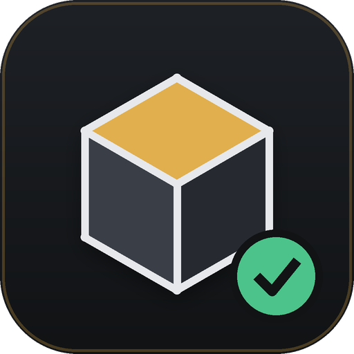

# Meshwright

### Know why your model won't print. Fix it. Prove it.

**Mesh analysis, repair, texturing and STL preparation for 3D printing**
by [Geekatplay Studio](https://www.geekatplay.com) · Vladimir Chopine

[](LICENSE)
[](https://python.org)
[](#install)
[](tests/)
[](docs/MCP.md)

[**☕ Support development**](https://geekatplay.gumroad.com/coffee) · [Quick start](#quick-start) · [Features](#what-it-does) · [Docs](docs/) · [MCP server](docs/MCP.md) · [Troubleshooting](#troubleshooting)

</div>

---

Most "mesh repair" tools give you a spinner and a green tick. Meshwright tells you **what is wrong, exactly where it is on the model, what it did about it, and what the result actually measures** — and it never silently throws your work away.

<div align="center">
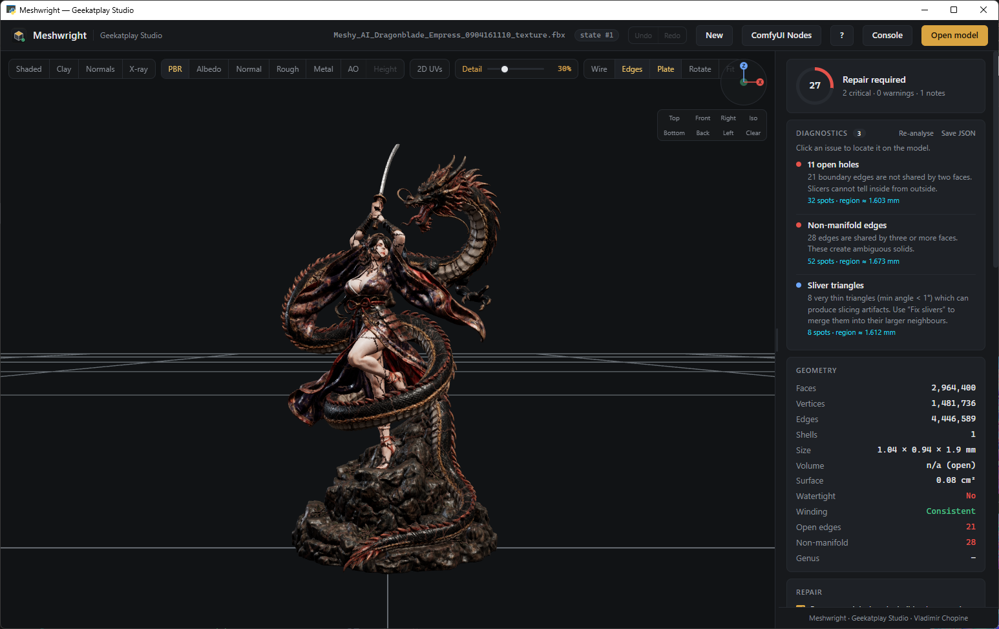
<br><em>A 2,964,400-triangle AI-generated model with its full PBR material set. Loaded in 13 seconds; the viewport draws a simplified copy so it appears immediately, while every measurement, repair and export uses all of it.</em>
</div>

---

## Why Meshwright

| | Typical repair tool | **Meshwright** |
|---|---|---|
| Diagnosis | "Mesh has errors" | 12 named checks, each with counts **and a clickable location on the model** |
| Repair | One black box | 6 measured stages — each kept **only if it provably helped** |
| Result | "Done ✓" | Before → after table, verified by a **fresh re-analysis** of the repaired mesh |
| Textures | Dropped on import | UVs and PBR maps **survive repair and reduction**, and go back out with the model |
| Dense models | Freezes, or crashes | Viewport draws a simplified copy; **native crashes are contained, never fatal** |
| Mistakes | Overwrites your model | Numbered states, **Ctrl+Z / Ctrl+Y**, explicit revert |
| Crash | Work lost | Background snapshots, **recovery offered on next start** |
| Reduction | One decimation slider | **QuadriFlow smart retopology**, uniform remesh, or quadric collapse — with measured surface deviation |
| Export | "Here is your STL" | Seven formats, and it **says when the file is not a solid** — the shell that slices with no infill |
| Automation | GUI only | **MCP server** + Python API on the identical engine |

---

## Quick start

1. Install **Python 3.10 or newer** from [python.org](https://www.python.org/downloads/windows/) —
   tick **"Add python.exe to PATH"** in the installer. Python 3.12 is the version Meshwright is
   tested against.
2. Download Meshwright and **extract the ZIP to a normal folder** such as `C:\Meshwright`
   (running it from inside the ZIP installs into a folder Windows later deletes).
3. Run `install.bat`, then `start.bat`.

```bash
git clone https://github.com/GeekatplayStudio/Meshwright.git
cd Meshwright
install.bat          # or:  .\install.ps1
start.bat            # or:  .\start.ps1
```

No model to hand? Press **Load demo model** on the empty screen — a small broken test object is
built in memory, nothing is downloaded and nothing is written to disk.

<div align="center">
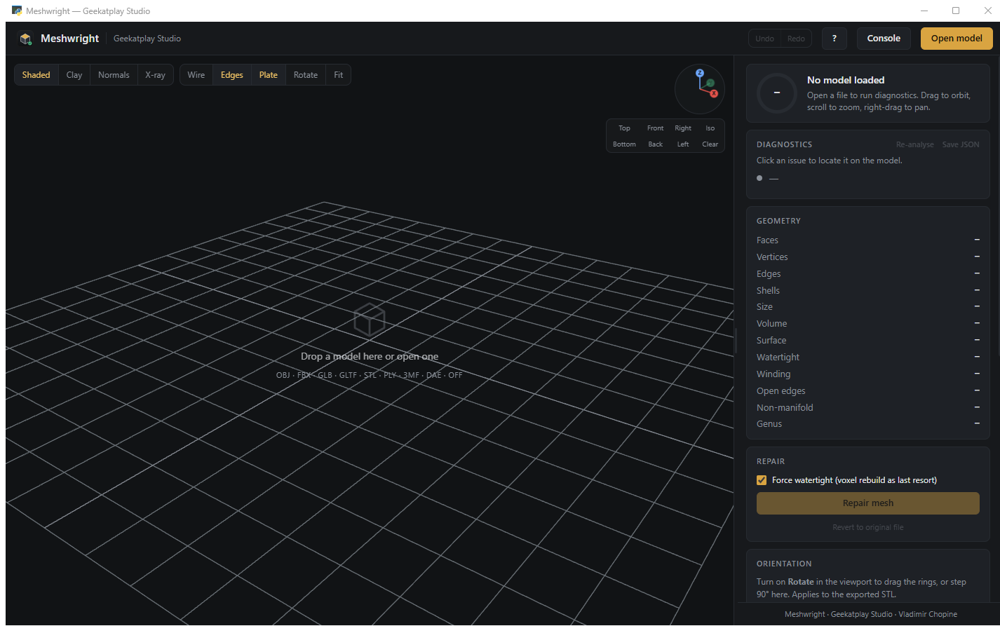
</div>

### What the installer does

It builds an isolated `.venv` next to the program, so nothing on your machine changes. Required
packages all ship ready-made wheels — no compiler needed. The heavier mesh engines are installed
**one at a time** and any that fail are skipped, so a single missing build can never abort the
installation. Whatever is absent is simply not offered inside the program — run
`.venv\Scripts\python scripts\check_install.py` to see exactly what your copy has.

---

## What it does

### 1 · Diagnose — 12 checks, every one locatable

Open holes · boundary edges · non-manifold edges · face winding · inside-out normals · degenerate triangles · duplicate faces · duplicate vertices · unused vertices · sliver triangles · separate shells · unusual scale — plus volume, surface area, genus and bounding size.

<div align="center">
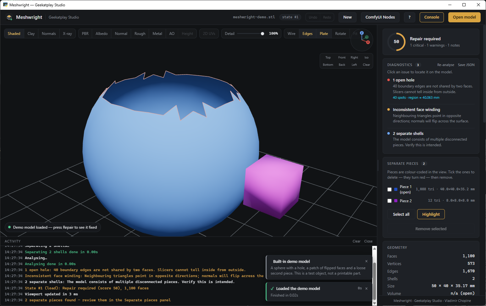
<br><em>Every issue named, counted and graded — with a 0–100 readiness score that tells you at a glance whether the model is ready to slice.</em>
</div>

Click any issue and Meshwright flies the camera to it and marks the exact spots in cyan, with a translucent sphere so even a single bad triangle on a huge model is findable.

<div align="center">
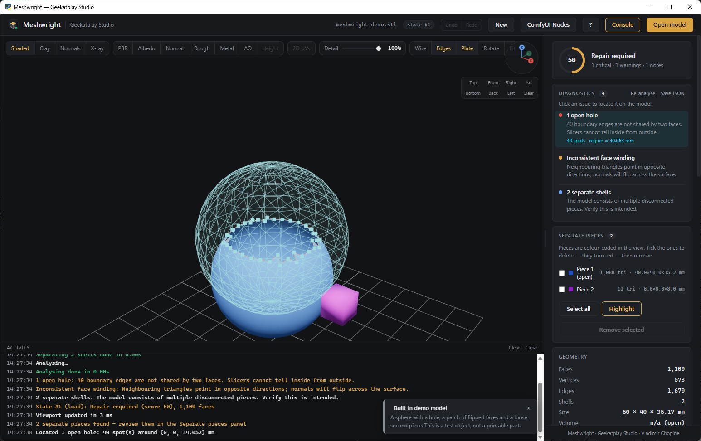
<br><em>Not just counted — located.</em>
</div>

### 2 · Repair — six stages, each one measured

```
Cleanup → Orientation → Hole filling → MeshFix → MeshLab → Manifold3D → Voxel remesh
```

A stage is only recorded as a fix if the diagnostics actually changed. The pipeline repeats until the mesh stops changing, then **re-analyses the result from scratch** — the report you see is measured on the repaired mesh, never predicted.

<div align="center">
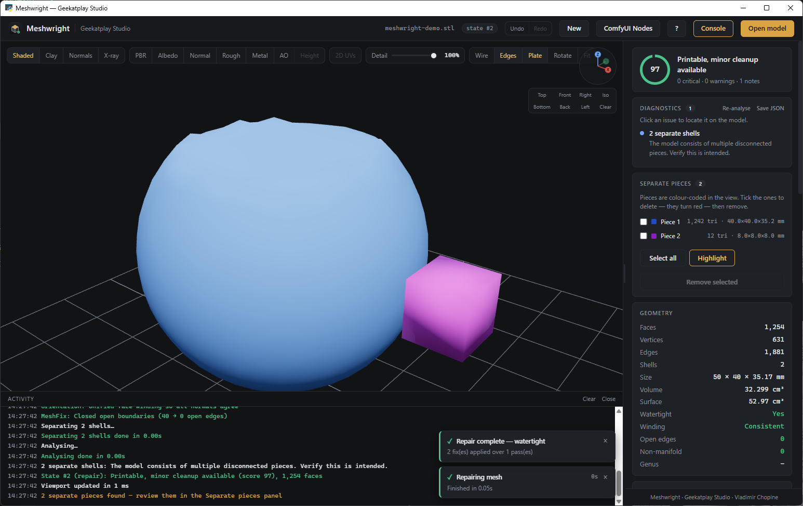
<br><em>"What was fixed" plus a before → after table. If anything remains, it says so.</em>
</div>

### 3 · Textures and PBR — they survive the trip

Meshwright keeps whatever textures came with your model, and keeps them lined up through everything you do to it.

**It finds them.** Textures baked into the file (GLB, glTF, FBX) are read from the model's own material. Textures the file only points at — an OBJ with its `.mtl`, or a folder of PNGs beside the model — are found by name, including the layouts Meshy, Tripo, Sketchfab and Blender export: `model.png`, `*_baseColor`, `*_Normal_OpenGL`, `*_Roughness`, `*_AO`, and packed `*_ORM` / `*_metallicRoughness` maps, which are unpacked into their separate channels. Some generators embed a 2×2 placeholder in the FBX and ship the real 2048px maps as separate files; Meshwright ignores the placeholder and uses the artwork.

**They stay put.** Texture coordinates are held per face corner, beside the mesh rather than inside it, so the geometry stays a properly welded solid while they travel with it. Repairing or decimating a textured model does not turn it into a pile of pieces, and the readiness score reflects the real geometry. Measured drift after decimating to a fiftieth of the original face count: under half a texel on a 2048px map.

<div align="center">
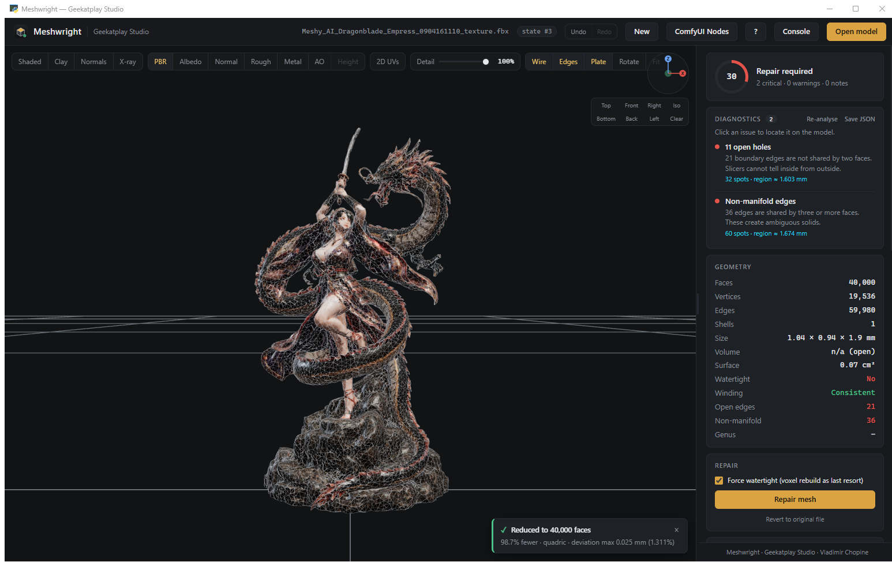
<br><em>2,964,400 → 40,000 triangles, 98.7% fewer, maximum surface deviation 0.025 mm — with the PBR material still mapped correctly.</em>
</div>

**Unwrap, generate, paint, bake.** **Unwrap UVs** builds a layout without touching the geometry — a watertight model stays watertight and its score does not move. **Load Image / Generate PBR** derives normal, roughness, metallic, ambient-occlusion and height maps from any photo or texture. **Export Maps** writes every channel plus a transparent UV guide to open as a layer in Photoshop or GIMP; **Reload Maps** picks your edits back up; **Save Baked GLB** writes one self-contained file. Everything Meshwright writes has its seam gutters padded, so textures do not show dark fringes where the islands meet.

<div align="center">
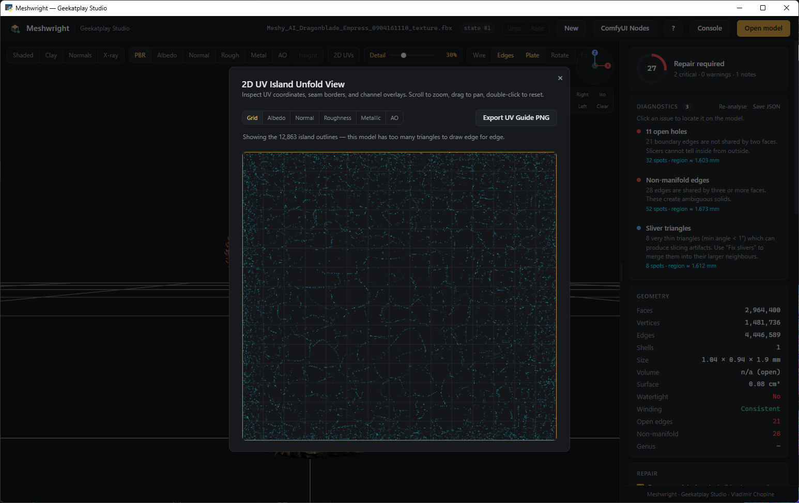
<br><em>The 2D unfold view, with any channel as a backdrop. On a dense model it draws the island outlines rather than a field of specks.</em>
</div>

### 4 · Viewport detail — big models appear straight away

A model with millions of triangles takes a while to draw, so Meshwright shows a simplified copy and says so. Drag the **Detail** slider up for the full mesh, or down to spin it more freely.

<div align="center">
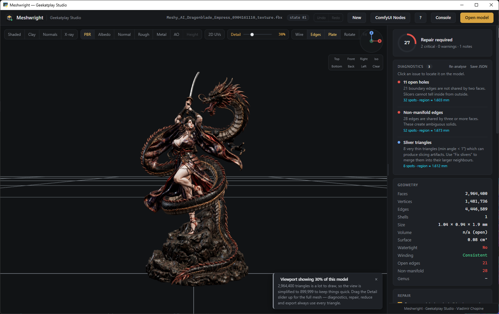
<br><em>2,964,400 triangles drawn as 899,999 so it appears immediately — and it tells you, rather than quietly showing you something else.</em>
</div>

This is the picture only. The diagnostics, repair, reduce, retopology and every export always use every triangle in the model — the number in the Geometry panel is the real one.

### 5 · Reduce — smart retopology down to low-poly

Three engines, one absolute face target, presets from **500** to **50k**:

- **Smart retopo** — [QuadriFlow](https://github.com/hjwdzh/QuadriFlow), the quad remesher used inside Blender. Rebuilds the surface as clean, evenly sized, curvature-aligned quads. Best for sculpts, scans and true low-poly.
- **Decimate** — quadric edge collapse. Sharpest; keeps hard edges.
- **Uniform** — isotropic remesh to equal-size triangles, then collapse. Best for noisy scans.

Every reduction reports how far the result strays from the original, in millimetres and as a percentage of model size. No guessing.

> Remeshers can open holes on topologically complex shapes. Meshwright checks the result of every piece and repairs it with MeshFix — or falls back to a different engine — so a reduction never hands back a worse mesh than it was given. QuadriFlow itself runs in a child process on a two-minute budget: it is native code that can abort or stall unpredictably, and neither should ever take your session with it.

### 6 · Separate pieces

Multi-part models are split, colour-coded and listed with triangle counts and sizes. Tick the ones you don't want — they turn red in the viewport — then remove them. Select all with <kbd>Ctrl</kbd>+<kbd>A</kbd>.

<div align="center">
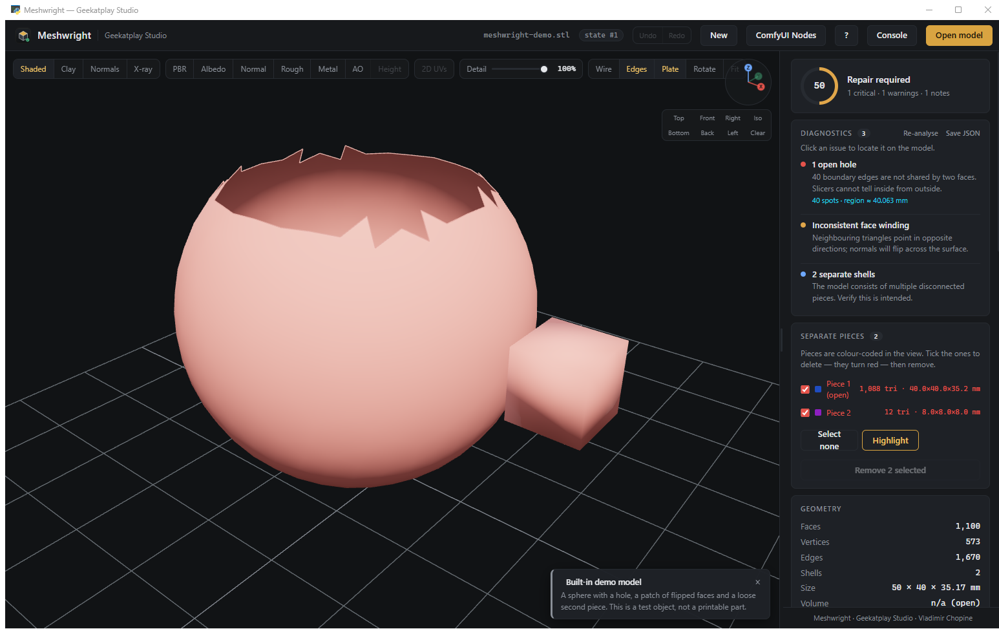
</div>

### 7 · Nothing is ever lost

Every change creates a **numbered state**.

- <kbd>Ctrl</kbd>+<kbd>Z</kbd> / <kbd>Ctrl</kbd>+<kbd>Y</kbd> move between states — nothing else moves backwards.
- A change that would **add critical problems** or **discard most of the geometry** is rejected, your previous state is kept, and you are offered "apply anyway".
- Every accepted state is snapshotted to disk in a background thread. If the app dies, the next start offers to **recover** it.
- **Revert to original** is explicit, confirmed, and itself undoable.
- **New** (<kbd>Ctrl</kbd>+<kbd>N</kbd>) or <kbd>Del</kbd> closes the model and empties the workspace, after a confirmation.

### 8 · Always know what it is doing

Long operations announce themselves before they start — how many faces they are about to process and roughly how long it will take — then show a live timer and progress bar in the bottom-right corner.

<div align="center">
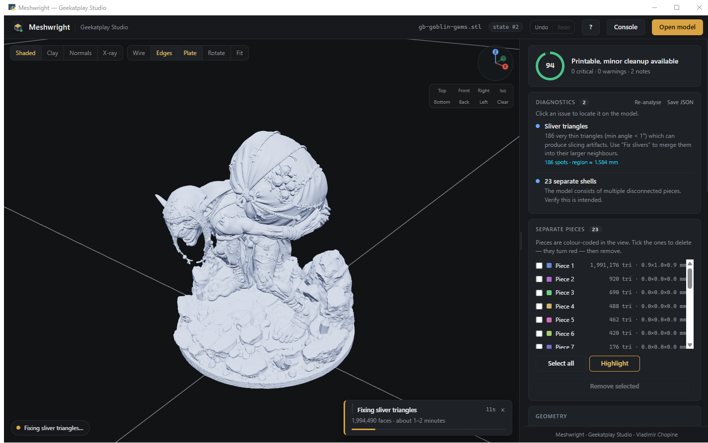
<br><em>No more wondering whether it froze.</em>
</div>

Everything also goes to the activity console with timestamps, and to stdout, so a long run can be followed from the terminal.

<div align="center">
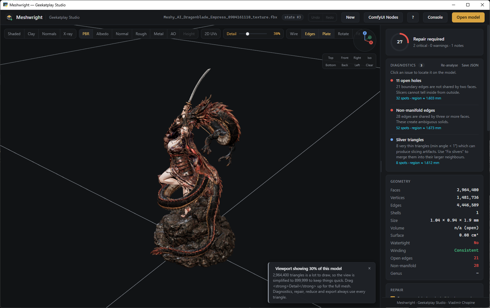
<br><em>Every backend step, with timings.</em>
</div>

### 9 · Someone to wait with

Opening a model and writing one out are the two waits worth watching, so that is when
a small cup strolls along the bottom of the window — and he leaves when the work is
done. Everything else shows its progress in the corner instead. Click him and he stops
to ask whether you would like to buy Vlad a coffee.

<div align="center">
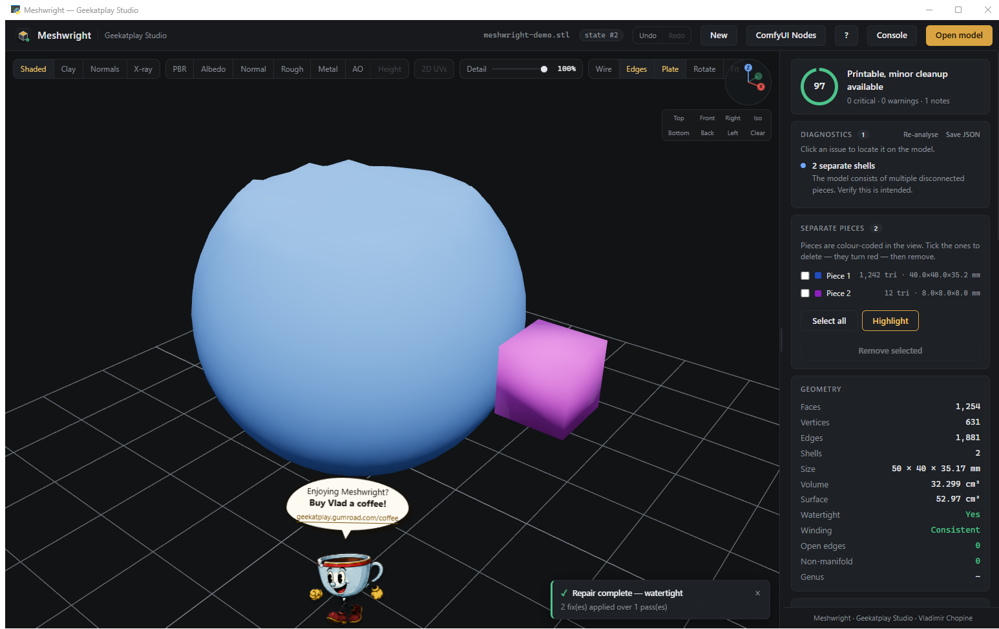
</div>

He is animated from a hand-drawn eight-frame cycle at twelve frames a second, stepped
rather than tweened, and he is timed by his own stride rather than by the clock, so he
covers the ground his feet claim to have covered instead of skating. The hop on each
step is in the drawings themselves; the only thing the code adds is a slow lean on a
different clock, because overlapping timings that never quite line up are what make a
rubber-hose walk read as drawn rather than as a sprite on rails. He keeps walking for
as long as the work takes, and if you start something else while he is on his way out
he turns round from wherever he happens to be standing.

### 10 · Export

STL, OBJ, PLY, OFF, GLB, glTF or 3MF with source-unit scaling (mm / cm / in) and build-plate alignment, plus a **JSON report** of the diagnostics and every operation applied — good for client sign-off or a print-farm audit trail.

OBJ, GLB and glTF carry your UV coordinates and PBR maps out with the model. STL, PLY, OFF and 3MF have no way to store them and are written as geometry only — which is what a slicer wants anyway.

Meshwright checks the mesh as it writes it, and says so on screen when the file **is not a closed solid**: an open surface makes a slicer produce a single-wall shell with no infill, no matter what the slicer settings say. Inside-out models are turned the right way out on the way to the file.


---

## The viewport

<div align="center">
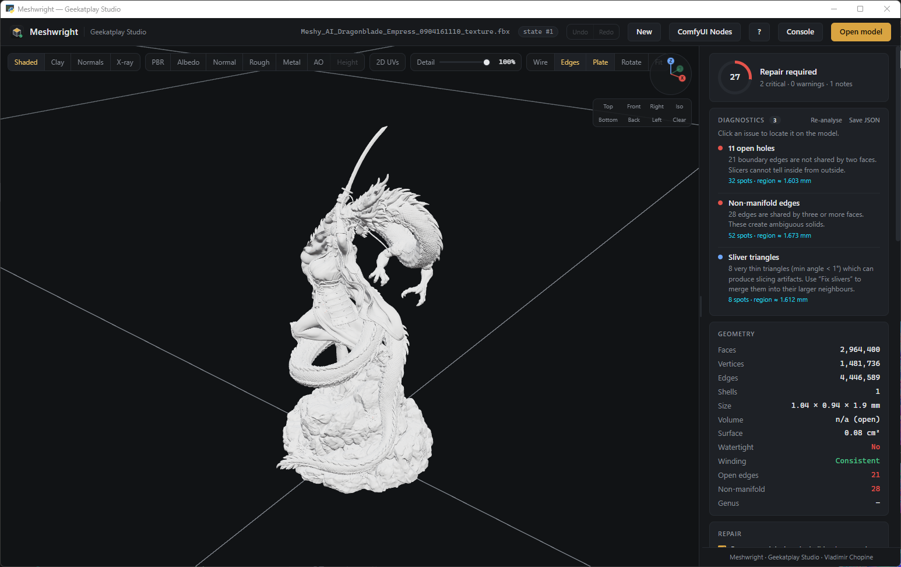
</div>

- **Shading**: Shaded · Clay · Normals · X-ray
- **PBR channels**: full material, or Albedo / Normal / Rough / Metal / AO / Height on their own
- **Detail slider** — how much of a dense model is drawn, without changing it
- **Overlays**: wireframe, red open-edge highlight, build plate
- **XYZ compass** and one-click **Top / Front / Right / Iso / Bottom / Back / Left**
- **Rotation gizmo** — drag rings or step 90°; applies to the exported STL
- Movable key light, resizable panel (remembers its width)

It renders on demand rather than continuously, so an idle window costs the GPU nothing.

## Keyboard

| | | | |
|---|---|---|---|
| <kbd>Ctrl</kbd>+<kbd>O</kbd> Open | <kbd>Ctrl</kbd>+<kbd>S</kbd> Export STL | <kbd>Ctrl</kbd>+<kbd>⇧</kbd>+<kbd>S</kbd> Save report | <kbd>Ctrl</kbd>+<kbd>Z</kbd> Undo |
| <kbd>Ctrl</kbd>+<kbd>Y</kbd> Redo | <kbd>Ctrl</kbd>+<kbd>R</kbd> Repair | <kbd>Ctrl</kbd>+<kbd>U</kbd> Re-analyse | <kbd>Ctrl</kbd>+<kbd>A</kbd> Select pieces |
| <kbd>Ctrl</kbd>+<kbd>N</kbd> Close model | <kbd>Del</kbd> Remove pieces / close | <kbd>R</kbd> Gizmo | <kbd>F</kbd> Fit |
| <kbd>W</kbd> Wireframe | <kbd>E</kbd> Open edges | <kbd>G</kbd> Plate | <kbd>1</kbd>–<kbd>7</kbd> Views |
| <kbd>Ctrl</kbd>+<kbd>`</kbd> Console | <kbd>Esc</kbd> Clear / close | <kbd>?</kbd> Help | |

<div align="center">
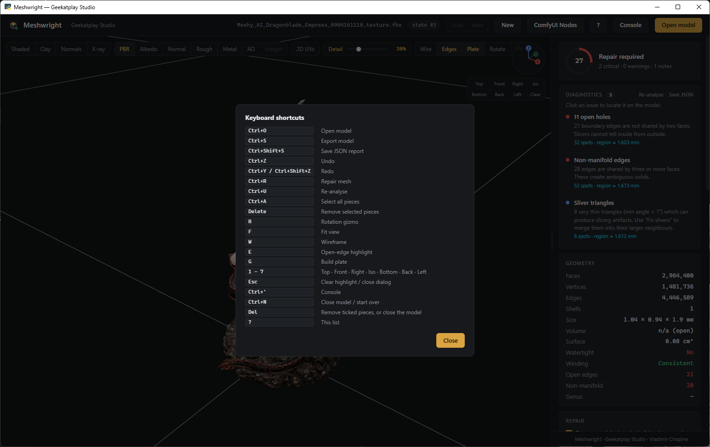
</div>

---

## Automation — MCP server & Python API

The desktop app is a thin shell over one engine. The same engine is available to AI assistants, editors and scripts.

```jsonc
// claude_desktop_config.json
{ "mcpServers": {
    "meshwright": { "command": "python", "args": ["D:/path/to/Meshwright/mcp_server.py"] }
} }
```

14 tools — `load_model, analyze, repair, fix_slivers, simplify, retopologize, remove_shells, rotate, undo, redo, revert, states, export_stl, export_report` — plus a `meshwright://report` resource.

```python
from engine.service import MeshService

svc = MeshService()
svc.load("dragon.fbx")                         # UVs and PBR maps come with it
svc.repair()                                   # measured, verified, undoable
svc.retopo(20000, method="quadriflow")         # smart retopology, UVs carried across
svc.export_model("dragon_low.glb", "glb")      # geometry, UVs and material
svc.export_stl("dragon_print_ready.stl")
```

Every input is validated, every call is guarded and undoable. See **[docs/MCP.md](docs/MCP.md)** and **[docs/API.md](docs/API.md)**.

---

## Supported formats

**In** — OBJ · FBX · GLB · GLTF · STL · PLY · 3MF · DAE · OFF · 3DS
**Out** — STL (binary) · OBJ · PLY · OFF · GLB · glTF · 3MF · JSON report · PBR texture pack

Textures come in embedded in the file or as companion images beside it, and go back out in OBJ,
GLB and glTF, or as a folder of PNGs with a UV guide for Photoshop.

Every export is unit-scaled, rested on the build plate, checked for solidity and named
`<original>-GS-<timestamp>-fixed.<ext>`, so it never overwrites what you opened.

---

## Built on

Meshwright is a careful integration of the best open mesh libraries. Full credit where it is due:

| Library | Role | Licence |
|---|---|---|
| [trimesh](https://github.com/mikedh/trimesh) | Loading, geometry, analysis, export | MIT |
| [QuadriFlow](https://github.com/hjwdzh/QuadriFlow) via [pyQuadriFlow](https://github.com/satabol/pyQuadriFlow) | Smart quad retopology | BSD-3 / MIT wrapper |
| [MeshFix](https://github.com/MarcoAttene/MeshFix-V2.1) via [pymeshfix](https://github.com/pyvista/pymeshfix) | Hole filling, self-intersection repair | GPL-3 ⚠ |
| [MeshLab](https://www.meshlab.net/) via [PyMeshLab](https://github.com/cnr-isti-vclab/PyMeshLab) | Non-manifold repair, decimation, isotropic remesh | GPL-3 ⚠ |
| [Manifold3D](https://github.com/elalish/manifold) | Guaranteed-manifold solid reconstruction | Apache-2.0 |
| [fast-simplification](https://github.com/pyvista/fast-simplification) | Fast quadric decimation | MIT |
| [scikit-image](https://scikit-image.org/) | Marching cubes for voxel remesh | BSD-3 |
| [NumPy](https://numpy.org/) · [SciPy](https://scipy.org/) | Array maths, spatial queries | BSD-3 |
| [xatlas](https://github.com/jpcy/xatlas) via [xatlas-python](https://github.com/mworchel/xatlas-python) | UV unwrapping and atlas packing | MIT |
| [Rtree](https://github.com/Toblerity/rtree) + [libspatialindex](https://github.com/libspatialindex/libspatialindex) | AABB queries behind exact UV transfer | MIT |
| [OpenCV](https://opencv.org/) | Texture gutter dilation | Apache-2.0 |
| [Pillow](https://python-pillow.org/) | Texture image IO and PBR map generation | MIT-CMU |
| [Three.js](https://threejs.org/) r128 | WebGL viewport | MIT |
| [pywebview](https://pywebview.flowrl.com/) | Desktop shell (Edge WebView2) | BSD-3 |
| [ufbx](https://github.com/ufbx/ufbx) | FBX fallback loader | MIT |
| [MCP SDK](https://github.com/modelcontextprotocol/python-sdk) | MCP server | MIT |

⚠ **Licensing note** — Meshwright's own code is MIT. PyMeshLab and pymeshfix are **GPL-3**. Using them is fine; redistributing a bundled binary means complying with the GPL. Both are optional — the pipeline degrades gracefully without them. See [docs/LICENSES.md](docs/LICENSES.md).

<div align="center">
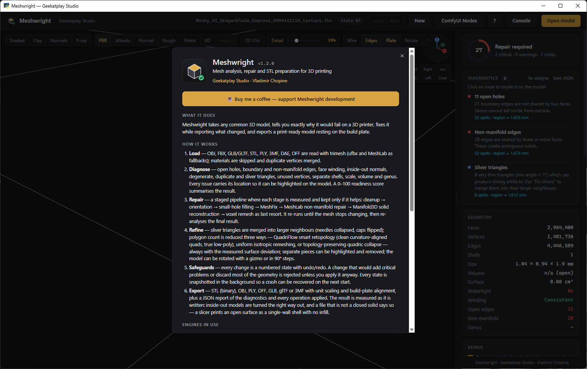
<br><em>The in-app About panel lists every engine with its installed version — click the studio name, top-left.</em>
</div>

---

## Documentation

| | |
|---|---|
| [docs/USER_GUIDE.md](docs/USER_GUIDE.md) | Every panel, button and workflow |
| [docs/DIAGNOSTICS.md](docs/DIAGNOSTICS.md) | What each check means and how to fix it |
| [docs/REDUCTION.md](docs/REDUCTION.md) | Choosing between retopology, decimation and remeshing |
| [docs/MCP.md](docs/MCP.md) | MCP server setup and every tool |
| [docs/API.md](docs/API.md) | Python API reference |
| [docs/ARCHITECTURE.md](docs/ARCHITECTURE.md) | How the engine is put together |
| [docs/LICENSES.md](docs/LICENSES.md) | Third-party licences in full |
| [CONTRIBUTING.md](CONTRIBUTING.md) | Development setup, tests, style |
| [CHANGELOG.md](CHANGELOG.md) | Release history |

Notes worth reading if you work with dense or textured models: **[ARCHITECTURE.md](docs/ARCHITECTURE.md)**
explains why texture coordinates live beside the mesh rather than inside it, how the viewport level of
detail keeps its promises, and what Meshwright does about the two native libraries that can crash.

---

## Troubleshooting

### “Python was not found; run without arguments to install from the Microsoft Store”

Windows ships a **placeholder** `python.exe` that only prints that message. It is on `PATH` out of
the box, so it looks like Python is installed when nothing is. Any one of these fixes it:

- Install Python from [python.org](https://www.python.org/downloads/windows/) and tick
  **“Add python.exe to PATH”** in the first screen of the installer. Then open a **new** window and
  run `install.bat` again — an already-open window keeps the old `PATH`.
- Or switch the placeholder off: **Settings → Apps → Advanced app settings → App execution
  aliases**, turn off **python.exe** and **python3.exe**.
- Already have Python somewhere unusual? Point the installer at it:
  `install.bat -Python "C:\Path\to\python.exe"`

`install.bat -Check` lists every interpreter Meshwright can find on the machine, which is the
quickest way to see what is really there.

### “[ERROR] Could not create the virtual environment”

Older versions printed this straight after the message above, because they believed the
placeholder was Python. The current installer tests each interpreter by running it, so this now
means something else — the message says which:

- **The folder cannot be written to.** Move Meshwright out of `Program Files`, out of a
  read-only share, and preferably out of OneDrive, into something like `C:\Meshwright`.
- **The install is running from inside the ZIP.** Extract it first: right-click the ZIP →
  *Extract All…*. Double-clicking `install.bat` inside a ZIP unpacks a copy into a temporary
  folder that Windows deletes later.
- **A half-finished `.venv` is in the way.** Run `install.bat -Recreate`.

### The install ends with “Engines skipped: …”

That is not a failure. Those engines are compiled extensions, and a Python released a few weeks ago
usually has no ready-made build for one or two of them yet. Meshwright runs and reports which
repair or retopology methods are unavailable; installing **Python 3.12** and running
`install.bat -Recreate` gets the complete set.

### Meshwright opened, but there is no model

Meshwright ships no 3D models — nothing to download, no folder to point it at. It works on the
files you already have: **Open model**, <kbd>Ctrl</kbd>+<kbd>O</kbd>, or drag a file onto the
window. To try it immediately, click **Load demo model** in the empty viewport; that builds a small
deliberately broken object in memory so you can watch the diagnostics and the repair work.

The black terminal window that opens next to it is the activity log. Keep it open — closing it
closes Meshwright.

### The exported STL slices as a thin shell — one layer, no infill

The slicer is right: the file is a **surface**, not a solid. A slicer fills the inside of a closed
volume; an open surface has no inside, so it becomes a single-wall shell however the infill is set.

Meshwright now says this out loud when it writes the file (“Saved, but this is not a printable
solid”), and the diagnostics panel flags it before that — look for **open holes** or
**boundary edges**, and the readiness score will be low. The fix is to press **Repair** and export
again; the panel must say *watertight* for a slicer to treat the model as solid.

Two related cases the export warning also covers:

- **“The model is hollow with walls averaging 0.4 mm.”** The model really is a shell — often a
  scan, or a surface exported from a CAD program with zero thickness. Give it thickness in the
  program it came from, or use the slicer’s vase/spiral mode deliberately.
- **Inside-out models.** Meshwright turns the winding the right way out as it exports, so a mesh
  the slicer used to read as a cavity comes out as a solid.

### Something else

Every install writes `install-log.txt` next to `install.bat`, and
`.venv\Scripts\python scripts\check_install.py` prints exactly which engines your copy has. Those
two outputs are what to attach to a bug report.

---

## Development

```bash
python -m venv .venv
.venv\Scripts\python -m pip install -r requirements-dev.txt
npm install       # vendors Three.js into ui/vendor and installs eslint

npm test          # pytest, 286 tests
npm run lint      # eslint + ruff
npm run mcp       # start the MCP server
```

Dependency versions in `requirements.txt` are deliberately bounded (`numpy>=1.26,<2.6` and so on) so
an install can never drag a shared environment to an incompatible version. Anything that needs a
compiler belongs in `requirements-optional.txt`, never in `requirements.txt`.

---

<div align="center">

### ☕ Support Meshwright

Meshwright is free and open source. If it saved you a failed print, a wasted spool, or an evening of hunting for a hole in a mesh — consider buying me a coffee.

[**geekatplay.gumroad.com/coffee**](https://geekatplay.gumroad.com/coffee)

---

**Geekatplay Studio** · Vladimir Chopine
[geekatplay.com](https://www.geekatplay.com) · [YouTube](https://www.youtube.com/@geekatplay) · [Gumroad](https://geekatplay.gumroad.com)

Released under the [MIT License](LICENSE).

</div>
