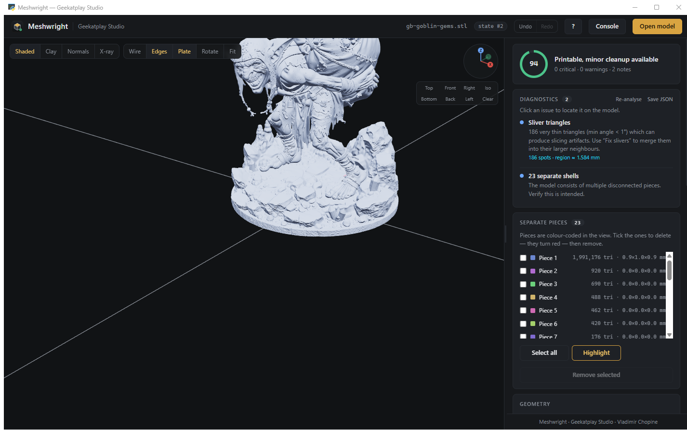
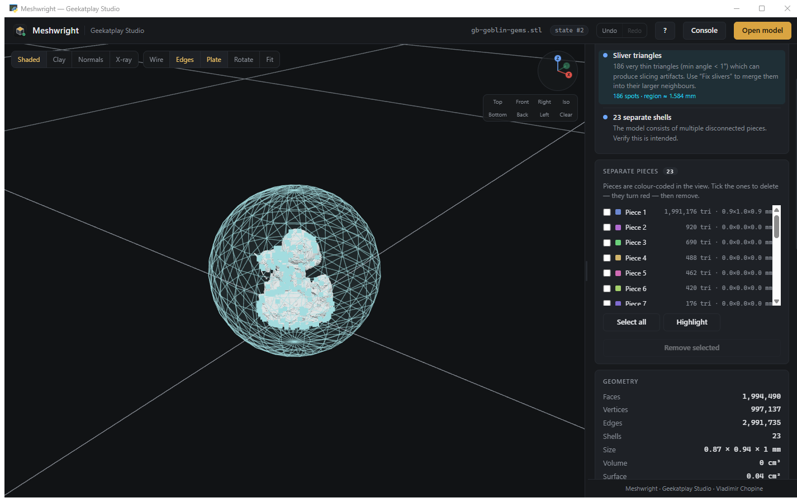
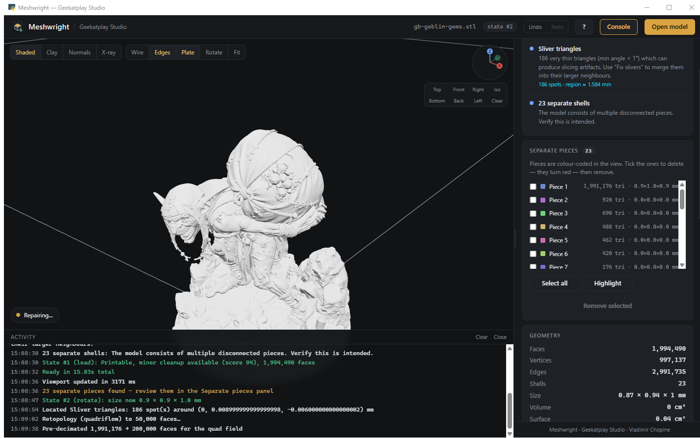
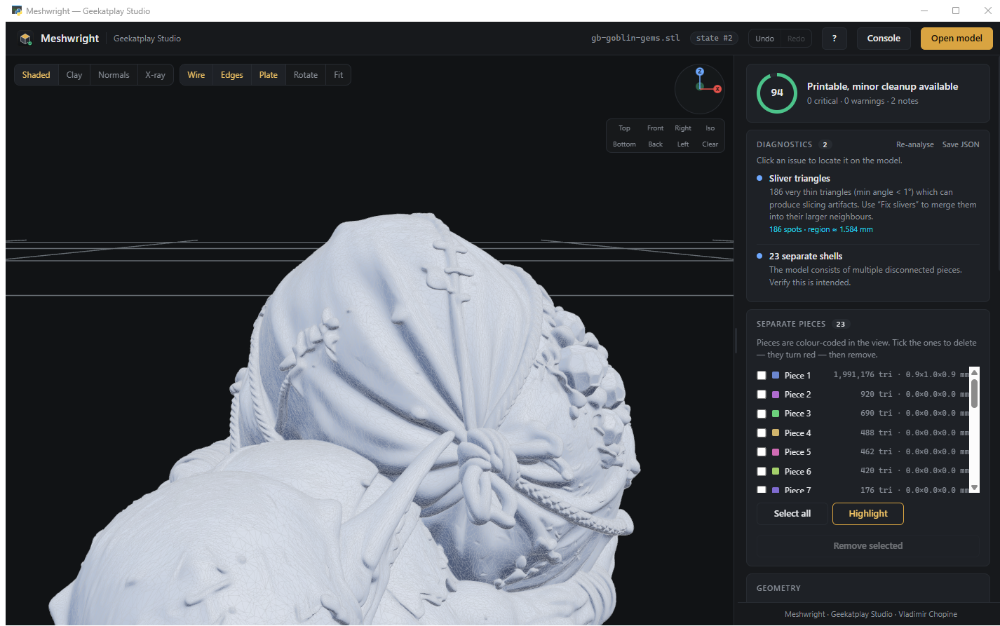
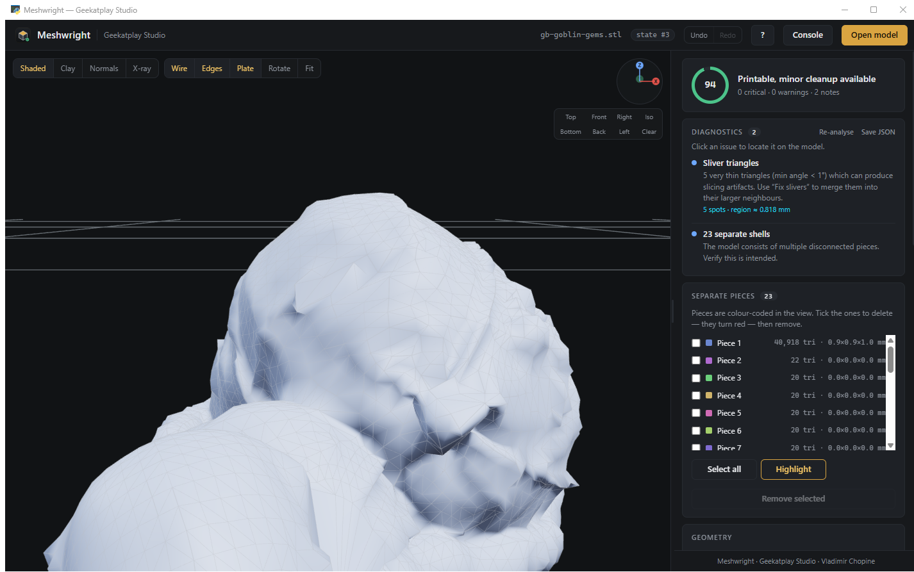
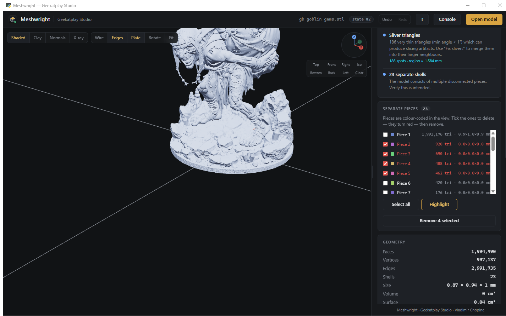
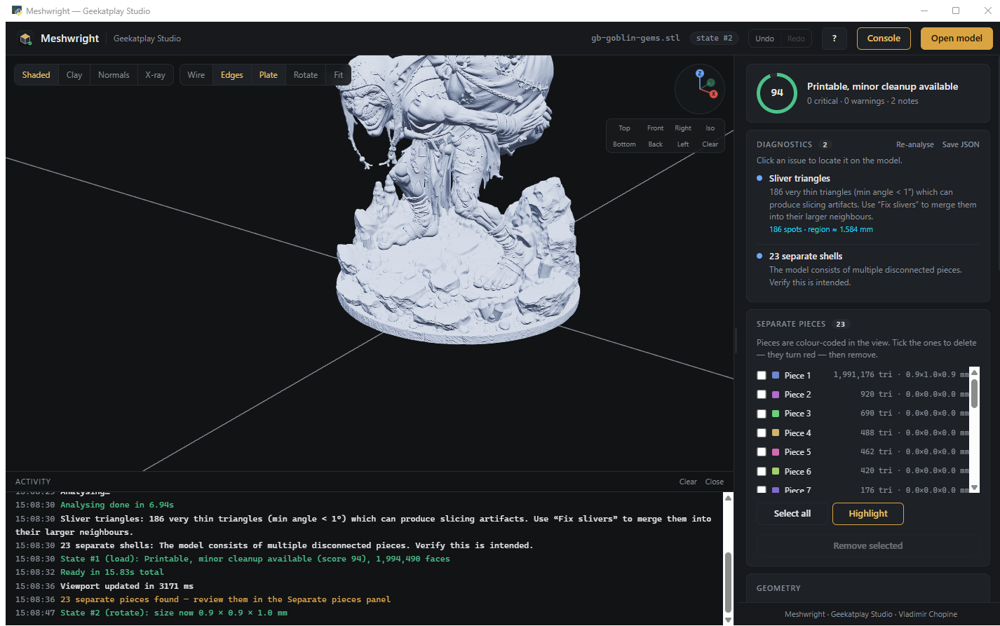
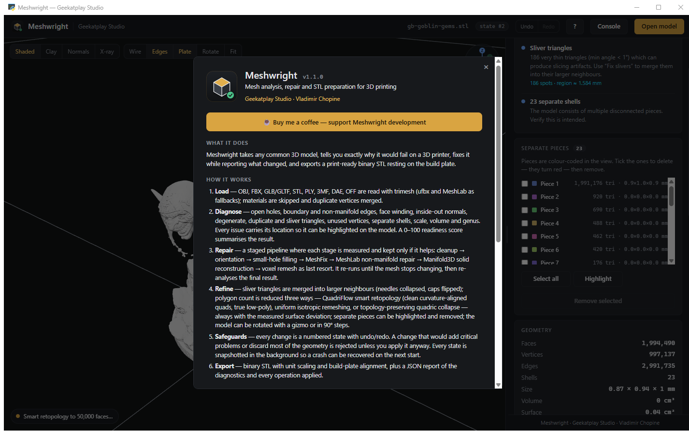

<div align="center">


# Meshwright

### Know why your model won't print. Fix it. Prove it.

**Mesh analysis, repair and STL preparation for 3D printing**
by [Geekatplay Studio](https://www.geekatplay.com) · Vladimir Chopine

[](LICENSE)
[](https://python.org)
[](#install)
[](tests/)
[](docs/MCP.md)

[**☕ Support development**](https://geekatplay.gumroad.com/coffee) · [Quick start](#quick-start) · [Features](#what-it-does) · [Docs](docs/) · [MCP server](docs/MCP.md)

</div>

---

Most "mesh repair" tools give you a spinner and a green tick. Meshwright tells you **what is wrong, exactly where it is on the model, what it did about it, and what the result actually measures** — and it never silently throws your work away.

<div align="center">

<br><em>A real 1,994,490-triangle miniature analysed in ~23 s: readiness score, every issue with its location, and all 23 separate pieces listed.</em>
</div>

---

## Why Meshwright

| | Typical repair tool | **Meshwright** |
|---|---|---|
| Diagnosis | "Mesh has errors" | 12 named checks, each with counts **and a clickable location on the model** |
| Repair | One black box | 6 measured stages — each kept **only if it provably helped** |
| Result | "Done ✓" | Before → after table, verified by a **fresh re-analysis** of the repaired mesh |
| Mistakes | Overwrites your model | Numbered states, **Ctrl+Z / Ctrl+Y**, explicit revert |
| Crash | Work lost | Background snapshots, **recovery offered on next start** |
| Reduction | One decimation slider | **QuadriFlow smart retopology**, uniform remesh, or quadric collapse — with measured surface deviation |
| Automation | GUI only | **MCP server** + Python API on the identical engine |

---

## Quick start

```bash
git clone https://github.com/GeekatplayStudio/Meshwright.git
cd Meshwright
install.bat          # or:  .\install.ps1   /   pip install -r requirements.txt
start.bat            # or:  .\start.ps1     /   python app.py
```

Requires **Python 3.10+**. Node.js is only needed for linting.

Drop a model onto the window, or press <kbd>Ctrl</kbd>+<kbd>O</kbd>.

---

## What it does

### 1 · Diagnose — 12 checks, every one locatable

Open holes · boundary edges · non-manifold edges · face winding · inside-out normals · degenerate triangles · duplicate faces · duplicate vertices · unused vertices · sliver triangles · separate shells · unusual scale — plus volume, surface area, genus and bounding size.

Click any issue and Meshwright flies the camera to it and marks the exact spots in cyan, with a translucent sphere so even a single bad triangle on a huge model is findable.

<div align="center">

<br><em>186 sliver triangles located on the model — not just counted.</em>
</div>

Every issue carries a severity, and the **0–100 readiness score** tells you at a glance whether the model is ready to slice.

### 2 · Repair — six stages, each one measured

```
Cleanup → Orientation → Hole filling → MeshFix → MeshLab → Manifold3D → Voxel remesh
```

A stage is only recorded as a fix if the diagnostics actually changed. The pipeline repeats until the mesh stops changing, then **re-analyses the result from scratch** — the report you see is measured on the repaired mesh, never predicted.

<div align="center">

<br><em>"What was fixed" plus a before → after table. If anything remains, it says so.</em>
</div>

### 3 · Reduce — smart retopology down to low-poly

Three engines, one absolute face target, presets from **500** to **50k**:

- **Smart retopo** — [QuadriFlow](https://github.com/hjwdzh/QuadriFlow), the quad remesher used inside Blender. Rebuilds the surface as clean, evenly sized, curvature-aligned quads. Best for sculpts, scans and true low-poly.
- **Decimate** — MeshLab topology-preserving quadric collapse. Sharpest; keeps hard edges.
- **Uniform** — isotropic remesh to equal-size triangles, then collapse. Best for noisy scans.

<table align="center">
<tr>
<td align="center"><br><em><b>Before</b> — 1,994,490 triangles</em></td>
<td align="center"><br><em><b>After</b> — 41,198 triangles, clean quad flow</em></td>
</tr>
</table>

That is a **97.9 % reduction in about 90 seconds**, and the readiness score stayed at **94** — still watertight, all 23 pieces intact, with a measured maximum surface deviation of **0.043 mm** (4.3 % of the model size).

Every reduction reports how far the result strays from the original, in millimetres and as a percentage of model size. No guessing.

> Remeshers can open holes on topologically complex shapes (this miniature is genus 114). Meshwright checks the result of every piece and repairs it with MeshFix — or falls back to a different engine — so a reduction never hands back a worse mesh than it was given.

### 4 · Separate pieces

Multi-part models are split, colour-coded and listed with triangle counts and sizes. Tick the ones you don't want — they turn red in the viewport — then remove them. Select all with <kbd>Ctrl</kbd>+<kbd>A</kbd>.

<div align="center">

</div>

### 5 · Nothing is ever lost

Every change creates a **numbered state**.

- <kbd>Ctrl</kbd>+<kbd>Z</kbd> / <kbd>Ctrl</kbd>+<kbd>Y</kbd> move between states — nothing else moves backwards.
- A change that would **add critical problems** or **discard most of the geometry** is rejected, your previous state is kept, and you are offered "apply anyway".
- Every accepted state is snapshotted to disk in a background thread. If the app dies, the next start offers to **recover** it.
- **Revert to original** is explicit, confirmed, and itself undoable.

### 6 · Export

Binary STL with source-unit scaling (mm / cm / in) and build-plate alignment, plus a **JSON report** of the diagnostics and every operation applied — good for client sign-off or a print-farm audit trail.

---

## The viewport

<div align="center">

<br><em>The slide-out console reports every backend step with timings — you always know what is happening.</em>
</div>

- **Shading**: Shaded · Clay · Normals · X-ray
- **Overlays**: wireframe, red open-edge highlight, build plate
- **XYZ compass** and one-click **Top / Front / Right / Iso / Bottom / Back / Left**
- **Rotation gizmo** — drag rings or step 90°; applies to the exported STL
- Movable key light, resizable panel (remembers its width)

## Keyboard

| | | | |
|---|---|---|---|
| <kbd>Ctrl</kbd>+<kbd>O</kbd> Open | <kbd>Ctrl</kbd>+<kbd>S</kbd> Export STL | <kbd>Ctrl</kbd>+<kbd>⇧</kbd>+<kbd>S</kbd> Save report | <kbd>Ctrl</kbd>+<kbd>Z</kbd> Undo |
| <kbd>Ctrl</kbd>+<kbd>Y</kbd> Redo | <kbd>Ctrl</kbd>+<kbd>R</kbd> Repair | <kbd>Ctrl</kbd>+<kbd>U</kbd> Re-analyse | <kbd>Ctrl</kbd>+<kbd>A</kbd> Select pieces |
| <kbd>Del</kbd> Remove pieces | <kbd>R</kbd> Gizmo | <kbd>F</kbd> Fit | <kbd>W</kbd> Wireframe |
| <kbd>E</kbd> Open edges | <kbd>G</kbd> Plate | <kbd>1</kbd>–<kbd>7</kbd> Views | <kbd>?</kbd> Help |

---

## Automation — MCP server & Python API

The desktop app is a thin shell over one engine. The same engine is available to AI assistants, editors and scripts.

```jsonc
// claude_desktop_config.json
{ "mcpServers": {
    "meshwright": { "command": "python", "args": ["D:/path/to/Meshwright/mcp_server.py"] }
} }
```

15 tools: `load_model, analyze, repair, fix_slivers, simplify, retopologize, remove_shells, rotate, undo, redo, revert, states, export_stl, export_report` + a `meshwright://report` resource.

```python
from engine.service import MeshService

svc = MeshService()
svc.load("miniature.stl")
svc.repair()                                   # measured, verified, undoable
svc.retopo(20000, method="quadriflow")         # smart retopology
svc.export_stl("miniature_print_ready.stl")
```

Every input is validated, every call is guarded and undoable. See **[docs/MCP.md](docs/MCP.md)** and **[docs/API.md](docs/API.md)**.

---

## Supported formats

**In** — OBJ · FBX · GLB · GLTF · STL · PLY · 3MF · DAE · OFF · 3DS
**Out** — binary STL · JSON report

---

## Built on

Meshwright is a careful integration of the best open mesh libraries. Full credit where it is due:

| Library | Role | Licence |
|---|---|---|
| [trimesh](https://github.com/mikedh/trimesh) | Loading, geometry, analysis, export | MIT |
| [QuadriFlow](https://github.com/hjwdzh/QuadriFlow) via [pyQuadriFlow](https://github.com/satabol/pyQuadriFlow) | Smart quad retopology | BSD-3 / MIT wrapper |
| [MeshFix](https://github.com/MarcoAttene/MeshFix-V2.1) via [pymeshfix](https://github.com/pyvista/pymeshfix) | Hole filling, self-intersection repair | GPL-3 ⚠ |
| [MeshLab](https://www.meshlab.net/) via [PyMeshLab](https://github.com/cnr-isti-vclab/PyMeshLab) | Non-manifold repair, decimation, isotropic remesh | GPL-3 ⚠ |
| [Manifold3D](https://github.com/elalish/manifold) | Guaranteed-manifold solid reconstruction | Apache-2.0 |
| [fast-simplification](https://github.com/pyvista/fast-simplification) | Fast quadric decimation | MIT |
| [scikit-image](https://scikit-image.org/) | Marching cubes for voxel remesh | BSD-3 |
| [NumPy](https://numpy.org/) · [SciPy](https://scipy.org/) | Array maths, spatial queries | BSD-3 |
| [Three.js](https://threejs.org/) r128 | WebGL viewport | MIT |
| [pywebview](https://pywebview.flowrl.com/) | Desktop shell (Edge WebView2) | BSD-3 |
| [ufbx](https://github.com/ufbx/ufbx) | FBX fallback loader | MIT |
| [MCP SDK](https://github.com/modelcontextprotocol/python-sdk) | MCP server | MIT |

⚠ **Licensing note** — Meshwright's own code is MIT. PyMeshLab and pymeshfix are **GPL-3**. Using them is fine; redistributing a bundled binary means complying with the GPL. Both are optional — the pipeline degrades gracefully without them. See [docs/LICENSES.md](docs/LICENSES.md).

<div align="center">

<br><em>The in-app About panel lists every engine with its installed version — click the studio name, top-left.</em>
</div>

---

## Documentation

| | |
|---|---|
| [docs/USER_GUIDE.md](docs/USER_GUIDE.md) | Every panel, button and workflow |
| [docs/DIAGNOSTICS.md](docs/DIAGNOSTICS.md) | What each check means and how to fix it |
| [docs/REDUCTION.md](docs/REDUCTION.md) | Choosing between retopology, decimation and remeshing |
| [docs/MCP.md](docs/MCP.md) | MCP server setup and every tool |
| [docs/API.md](docs/API.md) | Python API reference |
| [docs/ARCHITECTURE.md](docs/ARCHITECTURE.md) | How the engine is put together |
| [docs/LICENSES.md](docs/LICENSES.md) | Third-party licences in full |
| [CONTRIBUTING.md](CONTRIBUTING.md) | Development setup, tests, style |
| [CHANGELOG.md](CHANGELOG.md) | Release history |

---

## Development

```bash
pip install -r requirements.txt
npm install
npm test          # pytest, 52 tests
npm run lint      # eslint + ruff
npm run mcp       # start the MCP server
```

---

<div align="center">

### ☕ Support Meshwright

Meshwright is free and open source. If it saved you a failed print, a wasted spool, or an evening of hunting for a hole in a mesh — consider buying me a coffee.

[**geekatplay.gumroad.com/coffee**](https://geekatplay.gumroad.com/coffee)

---

**Geekatplay Studio** · Vladimir Chopine
[geekatplay.com](https://www.geekatplay.com) · [YouTube](https://www.youtube.com/@geekatplay) · [Gumroad](https://geekatplay.gumroad.com)

Released under the [MIT License](LICENSE).

</div>
